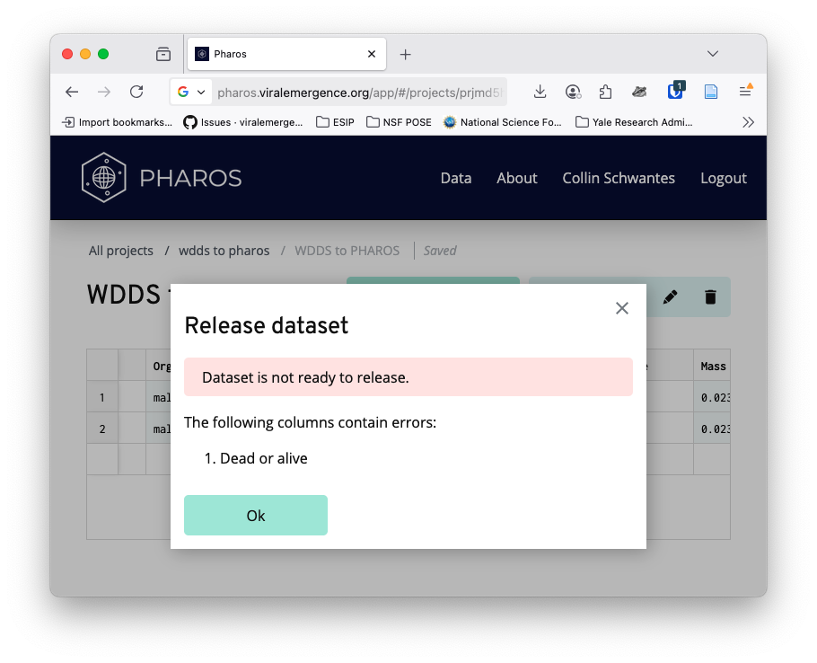

# WDDS to Pharos

The Wildlife Disease Data Standard (WDDS) was originally conceived as
being the data standard for
[Pharos](https://pharos.viralemergence.org/) - a data aggregation
platform for wildlife disease data. However, the standard has evolved
faster than the platform and as of September 2025, the two are out of
sync.

This vignette will focus on converting disease data from the WDDS
standard to be compatible with Pharos. As September 2025, Pharos does
not have an API that is programatically accessible for users. To upload
disease data, users must [log
in](https://pharos.viralemergence.org/app/#/login/) or [sign
up](https://pharos.viralemergence.org/app/#/sign-up/), create a project,
and either manually enter the data or use the CSV upload function to
bulk upload data.

See the
[`vignette("disease_data")`](https://viralemergence.github.io/wddsWizard/articles/disease_data.md)
for more information on validation.

``` r
library(wddsWizard)
library(dplyr)
#> 
#> Attaching package: 'dplyr'
#> The following objects are masked from 'package:stats':
#> 
#>     filter, lag
#> The following objects are masked from 'package:base':
#> 
#>     intersect, setdiff, setequal, union
library(readxl)
library(janitor)
#> 
#> Attaching package: 'janitor'
#> The following objects are masked from 'package:stats':
#> 
#>     chisq.test, fisher.test
library(jsonlite)
library(taxize)
```

## Read in and Clean up the excel spreadsheet

``` r
## read
becker_data <- wddsWizard::wdds_example_data(version = "latest", file = "becker_demo_dataset.csv") |>
  readr::read_csv()
#> Rows: 2 Columns: 22
#> ── Column specification ────────────────────────────────────────────────────────
#> Delimiter: ","
#> chr (15): Sample ID, Animal ID, Sample collection method, Sample collection ...
#> dbl  (6): Latitude, Longitude, Collection day, Collection month, Collection ...
#> lgl  (1): Live capture
#> 
#> ℹ Use `spec()` to retrieve the full column specification for this data.
#> ℹ Specify the column types or set `show_col_types = FALSE` to quiet this message.

becker_data_prelim <- janitor::clean_names(becker_data, case = "lower_camel")

### Check for required Fields

# check that required fields are in dataset
required_field_check <- wddsWizard::disease_data_required_fields %in% names(becker_data_prelim)

wddsWizard::disease_data_required_fields[!required_field_check]
#> [1] "sampleID"

### Rename Fields to match standard

# see all field names in the disease data schema
# wddsWizard::disease_data_schema$properties |> names()

becker_data_clean <- becker_data_prelim |>
  dplyr::rename(
    "sampleID" = "sampleId",
    "animalID" = "animalId"
  )
```

## Differences in required fields

Unlike WDDS, the Pharos data standard requires `Collection month`,
`Collection day`, and `Collection year` to be present and not blank for
all records in a dataset. See the [Pharos data
dictionary](https://pharos.viralemergence.org/guide-for-users/data-dictionary/)
for more details.

## Converting WDDS Data to Pharos Data

The WDDS to Pharos conversion happens by cross walking the two data
standards.

| wdds                      | pharos                       |
|:--------------------------|:-----------------------------|
| age                       | Age                          |
| ageUnits                  | NA                           |
| animalID                  | Animal ID                    |
| collectionDay             | Collection day               |
| collectionMonth           | Collection month             |
| collectionYear            | Collection year              |
| detectionMeasurement      | Detection measurement        |
| detectionMeasurementUnits | Detection measurement units  |
| detectionMethod           | Detection method             |
| detectionOutcome          | Detection outcome            |
| detectionTarget           | Detection target             |
| forwardPrimerSequence     | NA                           |
| genbankAccession          | GenBank accession            |
| geneTarget                | NA                           |
| hostIdentification        | Host species                 |
| hostLifeStage             | Life stage                   |
| latitude                  | Latitude                     |
| length                    | Length                       |
| lengthMeasurement         | NA                           |
| lengthUnits               | NA                           |
| liveCapture               | Dead or alive                |
| longitude                 | Longitude                    |
| mass                      | Mass                         |
| massUnits                 | NA                           |
| organismQuantity          | NA                           |
| organismQuantityUnits     | NA                           |
| organismSex               | Organism sex                 |
| parasiteID                | NA                           |
| parasiteIdentification    | Pathogen                     |
| parasiteLifeStage         | NA                           |
| primerCitation            | Primer citation              |
| probeCitation             | NA                           |
| probeTarget               | NA                           |
| probeType                 | NA                           |
| reversePrimerSequence     | Primer sequence              |
| sampleCollectionBodyPart  | NA                           |
| sampleCollectionMethod    | Collection method or tissue  |
| sampleID                  | Sample ID                    |
| sampleMaterial            | NA                           |
| spatialUncertainty        | Spatial uncertainty          |
| NA                        | Detection comments           |
| NA                        | Host species NCBI tax ID     |
| NA                        | Detection target NCBI tax ID |
| NA                        | Health notes                 |
| NA                        | Pathogen NCBI tax ID         |

### Convert the data

Be extremely careful when using this function.

While most of the aligned fields are a 1:1 match, the following fields
are not:

``` r

wdds_to_pharos_map |>
  dplyr::filter(wdds %in% c("forwardPrimerSequence", "liveCapture","reversePrimerSequence", "sampleCollectionMethod" ) | is.na(pharos)) |>
  kableExtra::kable() |>
    kableExtra::kable_styling()
```

| wdds                     | pharos                      |
|:-------------------------|:----------------------------|
| ageUnits                 | NA                          |
| forwardPrimerSequence    | NA                          |
| geneTarget               | NA                          |
| lengthMeasurement        | NA                          |
| lengthUnits              | NA                          |
| liveCapture              | Dead or alive               |
| massUnits                | NA                          |
| organismQuantity         | NA                          |
| organismQuantityUnits    | NA                          |
| parasiteID               | NA                          |
| parasiteLifeStage        | NA                          |
| probeCitation            | NA                          |
| probeTarget              | NA                          |
| probeType                | NA                          |
| reversePrimerSequence    | Primer sequence             |
| sampleCollectionBodyPart | NA                          |
| sampleCollectionMethod   | Collection method or tissue |
| sampleMaterial           | NA                          |

The `wdds_to_pharos` function takes some shortcuts to make reconciling
the fields easier. In general, WDDS is more granular than Pharos but
none of the multiple component fields are condensed to a single field -
e.g. the primer sequence fields are NOT combined Primer sequence and the
sample collection fields are not condensed to Collection method or
tissue. Certain fields are technically different types but can be
harmonized. For instance `liveCapture` is mapped directly to
`dead or alive` even though they are different types. Another major
difference is that in Pharos, units for certain measures are fixed and
the author of the data is told what they are when data are created,
while in WDDS they are part of the disease data.

``` r
becker_pharos <- wdds_to_pharos(wdds_disease_data = becker_data_clean)
#> `sampleCollectionMethod` does not map perfectly to `Collection method or tissue`. Please review those entries.
#> `liveCapture` does not map perfectly to `Dead or alive`. Please review those entries.

# readr::write_csv(becker_pharos,file = "wdds_to_pharos_example.csv")
```

### Upload data into Pharos

Uploading data to Pharos has to be done via the web portal. As Pharos is
still in beta testing, some features like password reset are clunky. We
strongly recommend using a password manager like
[bitwarden](https://bitwarden.com/) to store your credentials.

1.  Click on your username

2.  Click New Project or select an existing project

3.  Click create new dataset - below you can see the pre-determined
    units for different measures 

4.  Click add rows from CSV

After adding the the rows, the data will be validated against the PHAROS
schema. Valid columns will be highlighted in a light green and invalid
columns in a light red.


pharos upload

If you click publish, a validation report will be generated an any
issues will be noted.

 \## Improve
data for upload

``` r

# fix dead or alive
becker_pharos_da <- becker_pharos |>
  dplyr::mutate(`Dead or alive` = dplyr::case_when(
    FALSE ~ "dead",
    TRUE ~ "alive"
  ))

## add in ncbi taxa ids because we like standardization :) 

host_taxa <- taxize::get_uid(becker_pharos_da$`Host species`)
#> No ENTREZ API key provided
#>  Get one via taxize::use_entrez()
#> See https://ncbiinsights.ncbi.nlm.nih.gov/2017/11/02/new-api-keys-for-the-e-utilities/
#> ══  2 queries  ═══════════════
#> 
#> Retrieving data for taxon 'Desmodus rotundus'
#> ✔  Found:  Desmodus+rotundus
#> 
#> Retrieving data for taxon 'Desmodus rotundus'
#> ✔  Found:  Desmodus+rotundus
#> ══  Results  ═════════════════
#> 
#> • Total: 2 
#> • Found: 2 
#> • Not Found: 0
becker_pharos_da$`Host species NCBI tax ID` <- host_taxa

detection_target_taxa <- taxize::get_uid(becker_pharos_da$`Detection target`)
#> No ENTREZ API key provided
#>  Get one via taxize::use_entrez()
#> See https://ncbiinsights.ncbi.nlm.nih.gov/2017/11/02/new-api-keys-for-the-e-utilities/
#> ══  2 queries  ═══════════════
#> 
#> Retrieving data for taxon 'Coronaviridae'
#> ✔  Found:  Coronaviridae
#> 
#> Retrieving data for taxon 'Coronaviridae'
#> ✔  Found:  Coronaviridae
#> ══  Results  ═════════════════
#> 
#> • Total: 2 
#> • Found: 2 
#> • Not Found: 0
becker_pharos_da$`Detection target NCBI tax ID` <- detection_target_taxa

pathogen_taxa <- taxize::get_uid(becker_pharos_da$Pathogen)
#> No ENTREZ API key provided
#>  Get one via taxize::use_entrez()
#> See https://ncbiinsights.ncbi.nlm.nih.gov/2017/11/02/new-api-keys-for-the-e-utilities/
#> ══  2 queries  ═══════════════
#> 
#> Retrieving data for taxon 'Alphacoronavirus'
#> ✔  Found:  Alphacoronavirus
#> 
#> Retrieving data for taxon ''
#> Not found. Consider checking the spelling or alternate classification
#> ══  Results  ═════════════════
#> 
#> • Total: 2 
#> • Found: 1 
#> • Not Found: 0
becker_pharos_da$`Pathogen NCBI tax ID` <- pathogen_taxa

### write the csv

# readr::write_csv(becker_pharos_da,file = "wdds_to_pharos_example_corrected.csv")
```

### Pharos doesn’t like NA’s

Pharos says that instead of using NA for items without values, we should
leave them blank.


On no we need blanks not NA

``` r

# use the built in function na_to_blank 
beck_pharos_drop_nas <- na_to_blank(becker_pharos_da)


# readr::write_csv(beck_pharos_drop_nas,file = "wdds_to_pharos_example_final_final.csv")
  
```

Get yourself a treat - you just created a dataset ready to be shared on
Pharos!
